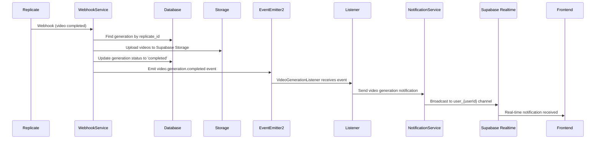

# Video Webhook Backend Analizi ve Frontend Entegrasyon Rehberi

## 🔍 Backend Mimari Analizi

### 1. Event-Driven Architecture (Olay Tabanlı Mimari)

Backend'de video webhook işleme süreci şu şekilde yapılandırılmış:

```
Replicate Webhook → ReplicateWebhookService → EventEmitter2 → VideoGenerationListener → NotificationService → Supabase Realtime
```

**✅ Progress Tracking Eklendi!** Artık `starting` ve `processing` statusları da destekleniyor.

### 2. Ana Bileşenler

#### A) ReplicateWebhookService (`src/modules/webhooks/services/replicate-webhook.service.ts`)
- **Amaç**: Replicate'ten gelen webhook eventlerini işler
- **Ana İşlevler**:
  - Webhook imza doğrulama (HMAC-SHA256)
  - Video model kontrolü (sadece video modelleri işlenir)
  - Retry mekanizması (3 deneme, exponential backoff)
  - Video URL'lerini Supabase Storage'e yükleme
  - Generation durumunu veritabanında güncelleme
  - Event emit etme (başarı/başarısızlık)
  - Otomatik kredi iadesi (başarısızlık durumunda)

#### B) Video Generation Events (`src/modules/notifications/events/video-generation.event.ts`)
```typescript
// Başarılı video üretimi eventi
VideoGenerationCompletedEvent {
  generationId: string,
  replicateId: string, 
  userId: string,
  model: string,
  modelVersion: string,
  sessionId: string,
  videoUrls: string[], // Supabase Storage URL'leri
  processingTime?: number,
  creditsUsed?: number
}

// Başarısız video üretimi eventi  
VideoGenerationFailedEvent {
  generationId: string,
  replicateId: string,
  userId: string,
  model: string,
  modelVersion: string, 
  sessionId: string,
  error: string,
  creditsUsed?: number
}

// Progress eventi (YENİ!)
VideoGenerationProgressEvent {
  generationId: string,
  replicateId: string,
  userId: string,
  model: string,
  modelVersion: string,
  sessionId: string,
  status: 'starting' | 'processing',
  progress?: number, // 0-100 percentage
  estimatedTime?: number, // seconds remaining
  startedAt?: string
}

// Kredi iadesi eventi
CreditRefundEvent {
  userId: string,
  creditsRefunded: number,
  reason: string,
  generationId?: string
}
```

#### C) VideoGenerationListener (`src/modules/notifications/listeners/video-generation.listener.ts`)
- **Amaç**: Video generation eventlerini dinler ve notification servisine yönlendirir
- **Event Dinleme**:
  - `video.generation.completed`
  - `video.generation.failed`
  - `video.generation.progress` ✨ **YENİ!**
  - `credit.refund`

#### D) NotificationService (`src/modules/notifications/services/notification.service.ts`)
- **Amaç**: Supabase Realtime üzerinden anlık bildirimler gönderir
- **Kanal Yapısı**:
  - User-specific channel: `user_{userId}`
  - General fallback channel: `notifications`
- **Bildirim Türleri**:
  - `VIDEO_GENERATION_COMPLETED`
  - `VIDEO_GENERATION_FAILED`
  - `VIDEO_GENERATION_PROGRESS` ✨ **YENİ!**
  - `CREDIT_REFUND`
  - `CREDIT_LOW_WARNING`

### 3. Veri Akışı



## 🚀 Frontend Entegrasyon Gereksinimleri

### 1. Supabase Realtime Client Kurulumu

```bash
npm install @supabase/supabase-js
```

```javascript
// supabase-client.js
import { createClient } from '@supabase/supabase-js'

const supabaseUrl = 'YOUR_SUPABASE_URL'
const supabaseAnonKey = 'YOUR_SUPABASE_ANON_KEY'

export const supabase = createClient(supabaseUrl, supabaseAnonKey, {
  realtime: {
    params: {
      eventsPerSecond: 10
    }
  }
})
```

### 2. Real-time Notification Listener

```javascript
// notification-service.js
import { supabase } from './supabase-client'

class NotificationService {
  constructor(userId) {
    this.userId = userId
    this.channel = null
    this.callbacks = {
      videoCompleted: [],
      videoFailed: [],
      videoProgress: [], // ✨ YENİ!
      creditRefund: [],
      lowCredit: []
    }
  }

  // Kullanıcının kanalına abone ol
  subscribe() {
    // User-specific channel
    this.channel = supabase
      .channel(`user_${this.userId}`)
      .on('broadcast', { event: 'notification' }, (payload) => {
        this.handleNotification(payload.payload)
      })
      .subscribe()

    // Fallback general channel
    this.generalChannel = supabase
      .channel('notifications')
      .on('broadcast', { event: 'notification' }, (payload) => {
        if (payload.payload.userId === this.userId) {
          this.handleNotification(payload.payload)
        }
      })
      .subscribe()
  }

  // Bildirim işleme
  handleNotification(notification) {
    console.log('Received notification:', notification)
    
    switch (notification.type) {
      case 'video_generation_completed':
        this.handleVideoCompleted(notification)
        break
      case 'video_generation_failed':
        this.handleVideoFailed(notification)
        break
      case 'video_generation_progress': // ✨ YENİ!
        this.handleVideoProgress(notification)
        break
      case 'credit_refund':
        this.handleCreditRefund(notification)
        break
      case 'credit_low_warning':
        this.handleLowCreditWarning(notification)
        break
      default:
        console.log('Unknown notification type:', notification.type)
    }
  }

  // Video tamamlandığında
  handleVideoCompleted(notification) {
    const { data } = notification
    const videoUrls = data.videoUrls || []
    
    // UI güncelleme
    this.callbacks.videoCompleted.forEach(callback => {
      callback({
        generationId: data.generationId,
        sessionId: data.sessionId,
        videoUrls: videoUrls,
        processingTime: data.processingTime,
        creditsUsed: data.creditsUsed,
        model: data.model,
        modelVersion: data.modelVersion
      })
    })
    
    // Toast/Snackbar bildirimi göster
    this.showToast(notification.title, notification.message, 'success')
  }

  // Video başarısız olduğunda
  handleVideoFailed(notification) {
    const { data } = notification
    
    this.callbacks.videoFailed.forEach(callback => {
      callback({
        generationId: data.generationId,
        sessionId: data.sessionId,
        error: data.error,
        creditsUsed: data.creditsUsed
      })
    })
    
    this.showToast(notification.title, notification.message, 'error')
  }

  // ✨ YENİ! Video progress güncellemesi
  handleVideoProgress(notification) {
    const { data } = notification
    
    this.callbacks.videoProgress.forEach(callback => {
      callback({
        generationId: data.generationId,
        sessionId: data.sessionId,
        status: data.status, // 'starting' veya 'processing'
        progress: data.progress,
        estimatedTime: data.estimatedTime,
        model: data.model,
        modelVersion: data.modelVersion
      })
    })
    
    // Progress notifications are usually not shown as toast (to avoid spam)
    // But you can show them for important status changes
    if (data.status === 'starting') {
      this.showToast('🟡 Video Starting', notification.message, 'info')
    }
  }

  // Kredi iadesi
  handleCreditRefund(notification) {
    const { data } = notification
    
    this.callbacks.creditRefund.forEach(callback => {
      callback({
        creditsRefunded: data.creditsRefunded,
        reason: data.reason,
        generationId: data.generationId
      })
    })
    
    this.showToast(notification.title, notification.message, 'info')
  }

  // Event callback'leri kaydetme
  onVideoCompleted(callback) {
    this.callbacks.videoCompleted.push(callback)
  }

  onVideoFailed(callback) {
    this.callbacks.videoFailed.push(callback)
  }

  onVideoProgress(callback) { // ✨ YENİ!
    this.callbacks.videoProgress.push(callback)
  }

  onCreditRefund(callback) {
    this.callbacks.creditRefund.push(callback)
  }

  // Toast/Snackbar gösterme
  showToast(title, message, type) {
    // Toast kütüphanenize göre implement edin
    // Örnek: react-hot-toast, notistack, vb.
    console.log(`[${type.toUpperCase()}] ${title}: ${message}`)
  }

  // Temizlik
  unsubscribe() {
    if (this.channel) {
      this.channel.unsubscribe()
    }
    if (this.generalChannel) {
      this.generalChannel.unsubscribe()
    }
  }
}

export default NotificationService
```

### 3. React Hook Implementation

```javascript
// useVideoNotifications.js
import { useEffect, useRef } from 'react'
import NotificationService from './notification-service'

export const useVideoNotifications = (userId) => {
  const notificationServiceRef = useRef(null)

  useEffect(() => {
    if (!userId) return

    // Notification servisini başlat
    notificationServiceRef.current = new NotificationService(userId)
    notificationServiceRef.current.subscribe()

    // Cleanup
    return () => {
      if (notificationServiceRef.current) {
        notificationServiceRef.current.unsubscribe()
      }
    }
  }, [userId])

  // Event listener'ları kaydetme fonksiyonları
  const onVideoCompleted = (callback) => {
    if (notificationServiceRef.current) {
      notificationServiceRef.current.onVideoCompleted(callback)
    }
  }

  const onVideoFailed = (callback) => {
    if (notificationServiceRef.current) {
      notificationServiceRef.current.onVideoFailed(callback)
    }
  }

  const onVideoProgress = (callback) => { // ✨ YENİ!
    if (notificationServiceRef.current) {
      notificationServiceRef.current.onVideoProgress(callback)
    }
  }

  const onCreditRefund = (callback) => {
    if (notificationServiceRef.current) {
      notificationServiceRef.current.onCreditRefund(callback)
    }
  }

  return {
    onVideoCompleted,
    onVideoFailed,
    onVideoProgress, // ✨ YENİ!
    onCreditRefund
  }
}
```

### 4. Component'te Kullanım

```javascript
// VideoGenerationDashboard.jsx
import React, { useState, useEffect } from 'react'
import { useVideoNotifications } from './hooks/useVideoNotifications'

const VideoGenerationDashboard = ({ userId }) => {
  const [generations, setGenerations] = useState([])
  const [loading, setLoading] = useState({})
  
  const { onVideoCompleted, onVideoFailed, onVideoProgress, onCreditRefund } = useVideoNotifications(userId) // ✨ onVideoProgress eklendi!

  useEffect(() => {
    // Video tamamlandığında
    onVideoCompleted((data) => {
      console.log('Video completed:', data)
      
      // Generation listesini güncelle
      setGenerations(prev => prev.map(gen => 
        gen.id === data.generationId 
          ? { 
              ...gen, 
              status: 'completed',
              videoUrls: data.videoUrls,
              processingTime: data.processingTime 
            }
          : gen
      ))
      
      // Loading state'ini temizle
      setLoading(prev => ({ ...prev, [data.generationId]: false }))
    })

    // Video başarısız olduğunda  
    onVideoFailed((data) => {
      console.log('Video failed:', data)
      
      setGenerations(prev => prev.map(gen =>
        gen.id === data.generationId
          ? { ...gen, status: 'failed', error: data.error }
          : gen
      ))
      
      setLoading(prev => ({ ...prev, [data.generationId]: false }))
    })

    // ✨ YENİ! Video progress takibi
    onVideoProgress((data) => {
      console.log('Video progress:', data)
      
      // Generation listesini güncelle - status ve progress
      setGenerations(prev => prev.map(gen =>
        gen.id === data.generationId
          ? { 
              ...gen, 
              status: data.status, // 'starting' or 'processing'
              progress: data.progress,
              estimatedTime: data.estimatedTime
            }
          : gen
      ))
    })

    // Kredi iadesi
    onCreditRefund((data) => {
      console.log('Credit refund:', data)
      // Kredi bakiyesini güncelle
      // setUserCredits(prev => prev + data.creditsRefunded)
    })
  }, [onVideoCompleted, onVideoFailed, onVideoProgress, onCreditRefund]) // ✨ onVideoProgress eklendi!

  const startVideoGeneration = async (prompt, modelVersion) => {
    try {
      const response = await fetch('/api/generations/create', {
        method: 'POST',
        headers: { 'Content-Type': 'application/json' },
        body: JSON.stringify({
          prompt,
          modelVersion,
          userId
        })
      })
      
      const { generationId, sessionId } = await response.json()
      
      // Loading state'i başlat
      setLoading(prev => ({ ...prev, [generationId]: true }))
      
      // Generation'ı listeye ekle
      setGenerations(prev => [...prev, {
        id: generationId,
        sessionId,
        prompt,
        modelVersion,
        status: 'pending', // İlk başta pending, sonra starting, processing...
        createdAt: new Date()
      }])
      
    } catch (error) {
      console.error('Failed to start video generation:', error)
    }
  }

  return (
    <div className="video-dashboard">
      <h2>Video Generations</h2>
      
      {generations.map(gen => (
        <div key={gen.id} className={`generation-card status-${gen.status}`}>
          <h3>{gen.prompt}</h3>
          <p>Model: {gen.modelVersion}</p>
          <p>Status: {gen.status}</p>
          
          {(gen.status === 'pending' || gen.status === 'starting' || gen.status === 'processing') && (
            <div className="loading-indicator">
              {gen.status === 'pending' && '⏳ Queued for processing...'}
              {gen.status === 'starting' && '🟡 Starting video generation...'}
              {gen.status === 'processing' && (
                <>
                  ⚙️ Processing video...
                  {gen.progress && ` ${gen.progress}%`}
                  {gen.estimatedTime && ` (${Math.round(gen.estimatedTime/60)} min remaining)`}
                </>
              )}
            </div>
          )}
          
          {gen.status === 'completed' && gen.videoUrls && (
            <div className="video-results">
              {gen.videoUrls.map((url, index) => (
                <video key={index} src={url} controls width="300" />
              ))}
              <p>Processing time: {gen.processingTime}s</p>
            </div>
          )}
          
          {gen.status === 'failed' && (
            <div className="error-message">
              Error: {gen.error}
            </div>
          )}
        </div>
      ))}
    </div>
  )
}

export default VideoGenerationDashboard
```

### 5. Gelişmiş Özellikler

#### A) Progress Tracking (İlerleyiş Takibi) ✅ **TAMAMLANDI!**
```javascript
// ✅ Bu özellik artık backend'de mevcut!
onVideoProgress((data) => {
  setGenerations(prev => prev.map(gen =>
    gen.id === data.generationId
      ? { 
          ...gen, 
          status: data.status, // 'starting' | 'processing'
          progress: data.progress, // 0-100
          estimatedTime: data.estimatedTime // seconds
        }
      : gen
  ))
})

// Progress bar component örneği
const ProgressBar = ({ progress, status, estimatedTime }) => (
  <div className="progress-container">
    <div className="progress-bar">
      <div 
        className="progress-fill" 
        style={{ width: `${progress || 0}%` }}
      />
    </div>
    <div className="progress-info">
      {status === 'starting' && '🟡 Starting...'}
      {status === 'processing' && `⚙️ ${progress || 0}%`}
      {estimatedTime && ` - ${Math.round(estimatedTime/60)} min left`}
    </div>
  </div>
)
```

#### B) Retry Mekanizması
```javascript
const retryGeneration = async (generationId) => {
  try {
    await fetch(`/api/generations/${generationId}/retry`, {
      method: 'POST'
    })
    setLoading(prev => ({ ...prev, [generationId]: true }))
  } catch (error) {
    console.error('Retry failed:', error)
  }
}
```

#### C) Bildirim Geçmişi
```javascript
const [notificationHistory, setNotificationHistory] = useState([])

// Her bildirimde geçmişe ekle
const addToHistory = (notification) => {
  setNotificationHistory(prev => [
    {
      ...notification,
      receivedAt: new Date()
    },
    ...prev.slice(0, 49) // Son 50 bildirimi tut
  ])
}
```

## ⚠️ Dikkat Edilmesi Gerekenler

### 1. Connection Management
- Kullanıcı offline olduğunda bağlantıyı yönetin
- Sayfa refresh'inde bağlantıyı yeniden kurun
- Connection state'ini takip edin

### 2. Error Handling
- Supabase bağlantı hatalarını yakalayın
- Bildirim alınamadığında fallback mekanizması kullanın
- Network hatalarında retry logic implementesyonu yapın

### 3. Performance
- Çok fazla bildirim gelirse throttling uygulayın
- Memory leak'leri önlemek için component unmount'ta subscription'ları temizleyin
- Büyük video dosyaları için lazy loading kullanın

### 4. Security
- Supabase RLS (Row Level Security) politikalarını doğru ayarlayın
- User authentication'ı mutlaka kontrol edin
- Sensitive bilgileri frontend'te store etmeyin

## 📋 Eksik Bileşenler ve Öneriler

### 1. Backend Durumu
- ✅ EventEmitter2 mevcut
- ✅ Supabase Realtime entegrasyonu mevcut  
- ✅ Retry mekanizması mevcut
- ✅ Error handling mevcut
- ✅ **Progress tracking EKLENDİ!** - `starting` ve `processing` statusları destekleniyor
- ⚠️ **Rate limiting eksik** - Webhook spam'ini önlemek için
- ⚠️ **Notification persistence eksik** - Offline kullanıcılar için bildirim saklama

### 2. Önerilen İyileştirmeler
- **Duplicate webhook handling**: Daha sağlam dublicate detection
- **Batch notification**: Çoklu video generation'ları için toplu bildirim
- **Analytics tracking**: Notification delivery success rates
- **User preferences**: Kullanıcı bildirim tercihlerini kaydetme

### 3. Frontend için Önerilen Kütüphaneler
```json
{
  "@supabase/supabase-js": "^2.55.0",
  "react-hot-toast": "^2.4.1", 
  "react-query": "^3.39.3",
  "zustand": "^4.4.7"
}
```

## ✨ Güncel Durum

✅ **Progress Tracking Sistemi Tamamlandı!**

Bu implementasyon ile kullanıcılar video üretimi sırasında **4 aşamalı** anlık geri bildirim alabilir:

1. 🔄 **pending** - İşlem kuyruğunda bekliyor
2. 🟡 **starting** - İşlem başlatılıyor  
3. ⚙️ **processing** - Video işleniyor (progress % ile)
4. ✅ **completed** / ❌ **failed** - Tamamlandı veya başarısız

**Kurulum için:**
```bash
# Migration'ı çalıştır
npm run migration:run

# Backend'i restart et
npm run start:dev
```

Artık frontend'inizde tam progress tracking sistemi kullanılabilir! 🚀